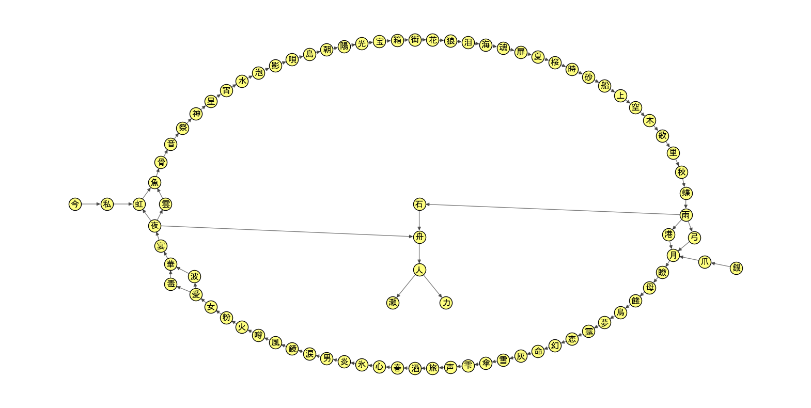

# japanese-song-title-chain

This is the GitHub repo for my Zhihu article: [How long a chain can you form with Japanese song titles?](https://zhuanlan.zhihu.com/p/1941166546039858082) (in Chinese)

In this article, I found several chains consisting of 77 songs whose titles have the format "●の○", where ● and ○ are single Chinese characters.

The algorithm I used is beam search plus genetic algorithm to optimize the parameters.
The resultant chains are likely not the longest.
I'd like to invite you to optimize the algorithm and discover longer chains!

## Content of this repo

The `code` folder contains the Python programs used for each step:

1. `1-scrape.py`: Scrape 377,965 song titles from uta-net.com.
2. `2-create-graph.py`: Create a directed graph from song titles of the format "●の○", and find its weakly and strongly connected components.
3. `3-visualize.py`: Visualize the weakly and strongly connected components.
4. `4-find-longest-cycle.py`: Find the longest cycle(s) in the unique strongly connected component.
5. `5-find-longest-path.py`: Find the longest path(s) in the largest weakly connected component.

Each step may write data into the `data/graph_data.pkl` file, which will be read by subsequent steps.

The `data` folder contains the data produced by each step:

* `songs.jsonl`: The title and artist of each song, in JSON format, one per line (produced by step 1).
* `graph_data.pkl`: A pickled dict that contains the following keys:
  * Created by step 2:
    * `connector`: The string "の", used for printing song titles.
    * `edges`: A dict that maps a node pair (●, ○) to a list of artists that have sung the song "●の○".
    * `graph`: A `networks.DiGraph` object representing the whole graph.
    * `weak_comps`: A list of weakly connected components. Each component is represented by a list of nodes, sorted by out_degree - in_degree in decreasing order.
    * `strong_comps`: A list of strongly connected components (there's actually only one). Each component is represented by a list of nodes, sorted by out_degree - in_degree in decreasing order.
  * Created by step 3:
    * `node_coords`: A dict that maps each node to its coordinates in the visualizations.
  * Created by step 4:
    * `longest_cycle`: A list that contains the nodes in the longest cycle found.
    * `best_params`: The beam search parameters corresponding to the longest cycle.
    * `longest_paths`: A dict that maps a node pair (●, ○) to all the longest paths from ● to ○. Each path is represented by a list of nodes, starting with ● and ending with ○.
* `weak_comps.png`, `strong_comps.png`: Visualizations of the weakly and strongly connected components.
* `longest_paths.png`: Visualization of all the longest chains.

## Longest chains found

The longest chains can be visualized in this image:



Below are the songs in the chains starting from `今` and `銀`, respectively:

Chain #1:
```
      1: 今の私 (一期一振・本阿弥光徳)
      2: 私の虹 (Sindy)
      3: 虹の魚 (吉田拓郎)
      4: 魚の骨 (藍坊主)
      5: 骨の音 (BBHF)
      6: 音の祭 (Non Stop Rabbit)
      7: 祭の神 (CLUB PRINCE feat. IKECHAN)
      8: 神の星 (MUCC)
      9: 星の宵 (初恋のテサキ)
     10: 宵の水 (THE MICETEETH)
     11: 水の泡 (a flood of circle, それでも世界が続くなら, ラフィータフィー)
     12: 泡の影 (King & Prince)
     13: 影の唄 (キリンジ)
     14: 唄の島 (やなわらばー)
     15: 島の朝 (加山雄三)
     16: 朝の陽 (ブレッド＆バター)
     17: 陽の光 (GReeeeN)
     18: 光の宝 (矢野まき)
     19: 宝の箱 (重ピンク・こはっピンク(モーニング娘。))
     20: 箱の街 (水槽)
     21: 街の花 (ジュースごくごく倶楽部)
     22: 花の狼 (Galileo Galilei)
     23: 狼の泪 (メランコリックサーカス)
     24: 泪の海 (黒川芽以)
     25: 海の魂 (気仙沼二郎)
     26: 魂の扉 (天野由梨)
     27: 扉の夏 (君島大空)
     28: 夏の桜 (木戸やすひろ)
     29: 桜の時 (aiko)
     30: 時の砂 (Bahashishi, Ryu, RIRIKO, 暁(内田雄馬)＆鈴蘭(内田真礼))
     31: 砂の船 (中島みゆき)
     32: 船の上 (ミツメ)
     33: 上の空 (一青窈)
     34: 空の木 (遠藤舞)
     35: 木の歌 (長澤知之 × 佐藤洋介 × 柴田隆浩(忘れらんねえよ))
     36: 歌の里 (美空ひばり)
     37: 里の秋 (童謡・唱歌, 由紀さおり・安田祥子, サエラ, 戸田恵子, 比嘉栄昇, 美輪明宏, 川田正子, さだまさし, 倍賞千恵子, 林部智史, 由紀さおり 安田祥子 featuring 木山裕策, 石川さゆり)
     38: 秋の蝶 (湯川正子)
     39: 蝶の雨 (弘田三枝子)
     40: 雨の弓 (剛紫, 久宝留理子)
        40': 雨の港 (大川栄策)
     41: 弓の月 (谷村新司)
        41': 港の月 (森昌子)
     42: 月の瞼 (La'cryma Christi)
     43: 瞼の母 (中村美律子, 秋山涼子, 天童よしみ, 島津亜矢, 杉良太郎, 三門忠司, 鏡五郎, 二葉百合子, 五木ひろし, 桂竜士, 蒼彦太, エドアルド, 朝花美穂, 福田こうへい, 川神あい, 村田英雄)
     44: 母の餞 (大門裕子)
     45: 餞の鳥 (D/Zeal)
     46: 鳥の夢 (小野大輔)
     47: 夢の露 (大川栄策)
     48: 露の恋 (森進一)
     49: 恋の幻 (wyolica)
     50: 幻の命 (SEKAI NO OWARI)
     51: 命の灰 (笹木勇一郎)
     52: 灰の雪 (D, ALDIOUS)
     53: 雪の傘 (弦哲也)
     54: 傘の雫 (イルカ)
     55: 雫の声 (イチヒメ(茅原実里))
     56: 声の旅 (甲斐田晴)
     57: 旅の酒 (小林旭, 小林旭, 氷川きよし, 池田輝郎)
     58: 酒の春 (我妻陽子)
     59: 春の心 (MAMALAID RAG)
     60: 心の氷 (フラワーカンパニーズ)
     61: 氷の炎 (青山ひかる)
     62: 炎の男 (北島三郎, ミケトロイズ)
     63: 男の涙 (北島三郎, 岡晴夫, 西方裕之)
     64: 涙の鏡 (竹村こずえ)
     65: 鏡の風 (来生たかお)
     66: 風の噂 (森進一, トンボコープ)
     67: 噂の火 (a flood of circle)
     68: 火の粉 (熊木杏里)
     69: 粉の女 (アーバンギャルド)
     70: 女の愛 (森進一)
     71: 愛の毒 (My Hair is Bad)
        71': 愛の波 (マカロニえんぴつ)
     72: 毒の華 (白石蔵ノ介(細谷佳正), 仁王雅治(増田裕生))
        72': 波の華 (真咲よう子, 華乃美幸)
     73: 華の宴 (藤あや子)
     74: 宴の夜 (FOOT STAMP)
     75: 夜の舟 (大石まどか)
     76: 舟の人 (おおたえみり)
     77: 人の瀬 (paionia)
        77': 人の力 (アンダーガールズ(AKB48))
```

Chain #2:
```
      1: 銀の爪 (MAMALAID RAG, 工藤静香)
      2: 爪の月 (辛島美登里)
      3: 月の瞼 (La'cryma Christi)
      4: 瞼の母 (中村美律子, 秋山涼子, 天童よしみ, 島津亜矢, 杉良太郎, 三門忠司, 鏡五郎, 二葉百合子, 五木ひろし, 桂竜士, 蒼彦太, エドアルド, 朝花美穂, 福田こうへい, 川神あい, 村田英雄)
      5: 母の餞 (大門裕子)
      6: 餞の鳥 (D/Zeal)
      7: 鳥の夢 (小野大輔)
      8: 夢の露 (大川栄策)
      9: 露の恋 (森進一)
     10: 恋の幻 (wyolica)
     11: 幻の命 (SEKAI NO OWARI)
     12: 命の灰 (笹木勇一郎)
     13: 灰の雪 (D, ALDIOUS)
     14: 雪の傘 (弦哲也)
     15: 傘の雫 (イルカ)
     16: 雫の声 (イチヒメ(茅原実里))
     17: 声の旅 (甲斐田晴)
     18: 旅の酒 (小林旭, 小林旭, 氷川きよし, 池田輝郎)
     19: 酒の春 (我妻陽子)
     20: 春の心 (MAMALAID RAG)
     21: 心の氷 (フラワーカンパニーズ)
     22: 氷の炎 (青山ひかる)
     23: 炎の男 (北島三郎, ミケトロイズ)
     24: 男の涙 (北島三郎, 岡晴夫, 西方裕之)
     25: 涙の鏡 (竹村こずえ)
     26: 鏡の風 (来生たかお)
     27: 風の噂 (森進一, トンボコープ)
     28: 噂の火 (a flood of circle)
     29: 火の粉 (熊木杏里)
     30: 粉の女 (アーバンギャルド)
     31: 女の愛 (森進一)
     32: 愛の毒 (My Hair is Bad)
        32': 愛の波 (マカロニえんぴつ)
     33: 毒の華 (白石蔵ノ介(細谷佳正), 仁王雅治(増田裕生))
        33': 波の華 (真咲よう子, 華乃美幸)
     34: 華の宴 (藤あや子)
     35: 宴の夜 (FOOT STAMP)
     36: 夜の雲 (和田唱)
        36': 夜の虹 (逢川まさき, 香田晋, 城南海, アマイワナ)
     37: 雲の魚 (吉田美奈子)
        37': 虹の魚 (吉田拓郎)
     38: 魚の骨 (藍坊主)
     39: 骨の音 (BBHF)
     40: 音の祭 (Non Stop Rabbit)
     41: 祭の神 (CLUB PRINCE feat. IKECHAN)
     42: 神の星 (MUCC)
     43: 星の宵 (初恋のテサキ)
     44: 宵の水 (THE MICETEETH)
     45: 水の泡 (a flood of circle, それでも世界が続くなら, ラフィータフィー)
     46: 泡の影 (King & Prince)
     47: 影の唄 (キリンジ)
     48: 唄の島 (やなわらばー)
     49: 島の朝 (加山雄三)
     50: 朝の陽 (ブレッド＆バター)
     51: 陽の光 (GReeeeN)
     52: 光の宝 (矢野まき)
     53: 宝の箱 (重ピンク・こはっピンク(モーニング娘。))
     54: 箱の街 (水槽)
     55: 街の花 (ジュースごくごく倶楽部)
     56: 花の狼 (Galileo Galilei)
     57: 狼の泪 (メランコリックサーカス)
     58: 泪の海 (黒川芽以)
     59: 海の魂 (気仙沼二郎)
     60: 魂の扉 (天野由梨)
     61: 扉の夏 (君島大空)
     62: 夏の桜 (木戸やすひろ)
     63: 桜の時 (aiko)
     64: 時の砂 (Bahashishi, Ryu, RIRIKO, 暁(内田雄馬)＆鈴蘭(内田真礼))
     65: 砂の船 (中島みゆき)
     66: 船の上 (ミツメ)
     67: 上の空 (一青窈)
     68: 空の木 (遠藤舞)
     69: 木の歌 (長澤知之 × 佐藤洋介 × 柴田隆浩(忘れらんねえよ))
     70: 歌の里 (美空ひばり)
     71: 里の秋 (童謡・唱歌, 由紀さおり・安田祥子, サエラ, 戸田恵子, 比嘉栄昇, 美輪明宏, 川田正子, さだまさし, 倍賞千恵子, 林部智史, 由紀さおり 安田祥子 featuring 木山裕策, 石川さゆり)
     72: 秋の蝶 (湯川正子)
     73: 蝶の雨 (弘田三枝子)
     74: 雨の石 (荻野目洋子)
     75: 石の舟 (黒木美佳)
     76: 舟の人 (おおたえみり)
     77: 人の瀬 (paionia)
        77': 人の力 (アンダーガールズ(AKB48))
```

You're welcome to create playlists based on these chains on various music platforms!
